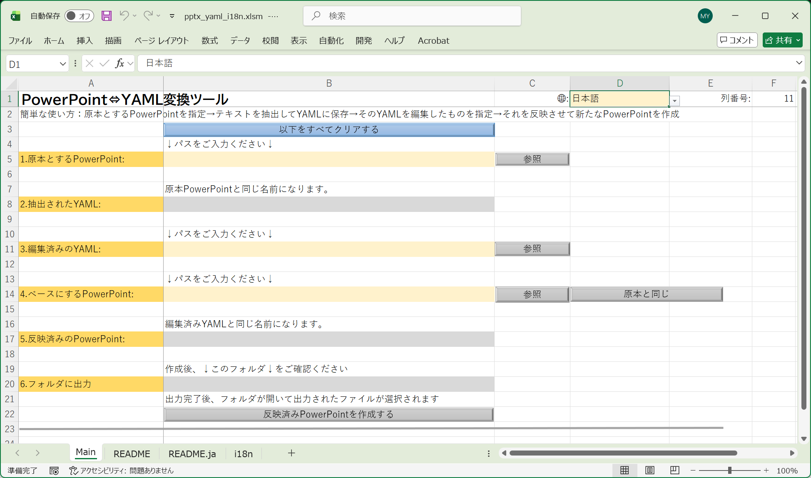

# pptx_yaml_excel

PowerPoint のテキストを YAML に書き出し、編集してプレゼンテーションに適用しなおす Excel VBA ツールです。



## ダウンロード

**利用者向け**: 以下のリンクから最新の `pptx_yaml_i18n.xlsm` をダウンロードしてください。インストール不要です。Excel で開いてマクロを有効にするだけで使えます。

[**pptx_yaml_i18n.xlsm をダウンロード（最新リリース）**](https://github.com/minipoisson/pptx_yaml_excel/releases/latest/download/pptx_yaml_i18n.xlsm)

**開発者向け**: このリポジトリをそのままクローンして使えます。[xlsm_devkit](https://github.com/minipoisson/xlsm_devkit) を使った開発の実例として、`src/*.bas` と `sheet/*.md` をバージョン管理しています。

## 用途と前提

- 主な用途は翻訳作業であり、スライドを繰り返し編集するための差分管理ツールではありません。
- YAML のキーはスライド構造・図形名・表の座標・段落順から生成されます。
- 原本 PowerPoint の構造（図形の追加・削除・改名など）が変わった場合は、YAML を再抽出してください。
- 構造変更後の古い YAML をそのまま適用すると、キーの不整合が多数発生する可能性があります。

## ワークフロー

1. 原本 PowerPoint を選択して YAML をエクスポートする。
2. YAML のテキスト値を編集する。
3. 編集済み YAML とベースとなる PowerPoint を選択する。
4. YAML を適用して出力 PowerPoint を生成する。

実行後、次の件数と一覧が表示されます。

- 適用されたキー
- PowerPoint にしか存在しないキー
- YAML にしか存在しないキー
- 不正形式の YAML 行

## YAML キーの仕様

キーのフォーマット:

```
sNN.shapePath.pNN
```

- `sNN`: スライド番号（2 桁）
- `shapePath`: 図形名ベースのパス（グループ階層を `.` でつなぐ）
- 表のセルは `.rNNcNN`（行・列の 0 始まり 2 桁）で表現
- `pNN`: 段落インデックス（0 始まり 2 桁）

同じスライド内で図形名が重複する場合、出現順に `_2`、`_3` … のサフィックスで区別されます。

## Main シートのセル配置

Main シートはアプリの UI として機能します。セル番地による運用は透明性・管理のしやすさを優先した意図的な設計です。

| セル | 内容 |
| :--- | :--- |
| B5 | 原本 PowerPoint のパス |
| B8 | エクスポートされた YAML のパス |
| B11 | 編集済み YAML のパス |
| B14 | ベース PowerPoint のパス |
| B17 | 出力 PowerPoint のパス |
| B20 | 出力フォルダ |

## Main シート保護ポリシー

配布版では、Main シートを誤操作防止のためにパスワードなしで保護します。
この保護は運用上の事故防止が目的であり、セキュリティ境界を提供するものではありません。

- ユーザー編集可能セル: `D1`, `B5`, `B11`, `B14`
- ロック対象セル: 数式/UI セル、および内部更新セル `B8`, `B17`, `B20`
- ブック起動時に `Workbook_Open` から `UserInterfaceOnly:=True` で保護を再適用します

`UserInterfaceOnly` は Excel 保存時に永続化されないため、ブックを開くたびに再設定が必要です。
マクロが無効の場合、この再適用処理は実行されません。

## 多言語対応の仕組み

- Main シートの UI ラベルはシート上の数式によって多言語化されています。
- VBA は実行時ダイアログのメッセージのみ多言語対応します。
- VBA は `Sheet1!D1`（言語名）と `Sheet1!F1`（言語列インデックス）を参照します。F1 はシート数式が管理します。
- 翻訳テキストは `i18n` シートに格納されています。

## 開発環境

このプロジェクトは [xlsm_devkit](https://github.com/minipoisson/xlsm_devkit) を使って開発しました。xlsm_devkit は Excel VBA プロジェクト向けの開発支援ツールキットです。

- `src/*.bas` — xlsm_devkit の `ExportAllModules`・`ImportAllModules` マクロで管理する VBA モジュール（UTF-8）
- `sheet/*.md` — xlsm_devkit の `ExportAllSheetMapsToMD` マクロで出力したシートマップ（Markdown）

### 前提条件

- Windows + Microsoft Excel（VBA 有効）
- Excel のマクロ設定で **VBA プロジェクト オブジェクト モデルへのアクセスを信頼する** を有効にしてください:
	```
	ファイル → オプション → トラスト センター → トラスト センターの設定
	  → マクロの設定 → VBA プロジェクト オブジェクト モデルへのアクセスを信頼する
	```
- xlsm_devkit が UTF-8（ファイル）と ANSI（VBE）の相互変換を担うため、`src/` の `.bas` ファイルは常に UTF-8 で保存されます。
