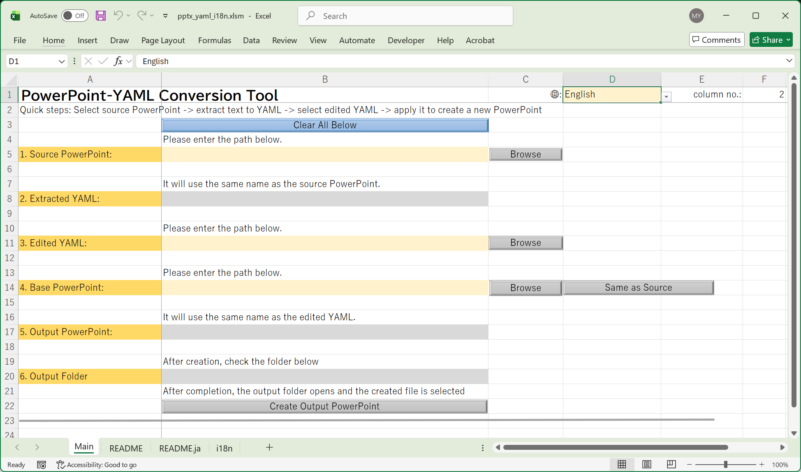

# pptx_yaml_excel

[日本語版 README はこちら](README.ja.md)

Excel VBA toolchain to extract translatable text from PowerPoint into YAML, edit it, and apply it back to a presentation copy.



## Download

**Users**: Download the latest `pptx_yaml_i18n.xlsm` from the link below. No installation required — open the file in Excel and enable macros.

[**Download pptx_yaml_i18n.xlsm (latest release)**](https://github.com/minipoisson/pptx_yaml_excel/releases/latest/download/pptx_yaml_i18n.xlsm)

**Developers**: Clone this repository. It serves as a working example of an [xlsm_devkit](https://github.com/minipoisson/xlsm_devkit)-based project, with `src/*.bas` and `sheet/*.md` under version control.

## Scope and Assumptions

- Primary use case is translation, not iterative slide editing.
- YAML keys are derived from slide structure, shape names, table coordinates, and paragraph order.
- If the source presentation structure changes, export YAML again before applying.
- Applying an old YAML file to a structurally edited deck may produce unexpected key mismatches.

## Workflow

1. Select source PowerPoint and export YAML.
2. Edit YAML values.
3. Select edited YAML and base PowerPoint.
4. Apply YAML to create an output PowerPoint copy.

The tool reports:

- applied keys
- keys that exist only in PowerPoint
- keys that exist only in YAML
- malformed YAML lines

## YAML Key Model

Key format is:

```
sNN.shapePath.pNN
```

- `sNN`: slide index
- `shapePath`: shape-name-based path (group hierarchy included)
- table cells are encoded as `.rNNcNN`
- `pNN`: paragraph index

Duplicate sibling shape names are disambiguated with suffixes like `_2`, `_3`.

## Main Sheet Contract

The Main sheet is intentionally address-based for transparent maintenance.

- `B5`: source PowerPoint
- `B8`: exported YAML path
- `B11`: edited YAML path
- `B14`: base PowerPoint for apply
- `B17`: output PowerPoint path
- `B20`: output folder

## Main Sheet Protection Policy

For release builds, the Main sheet is protected without a password to reduce accidental edits.
This protection is an operational safeguard and not a security boundary.

- user-editable cells: `D1`, `B5`, `B11`, `B14`
- locked cells include formula/UI cells and internal output cells: `B8`, `B17`, `B20`
- on each open, `Workbook_Open` reapplies sheet protection with `UserInterfaceOnly:=True`

Because `UserInterfaceOnly` is not persisted by Excel, protection settings are re-applied every time the workbook opens.
If macros are disabled, this runtime re-apply step will not run.

## Localization Design

- UI labels are localized by worksheet formulas.
- VBA localizes only runtime dialog messages.
- VBA reads language state from `Sheet1!D1` and language column index from `Sheet1!F1`.
- Translation text is stored in the `i18n` worksheet.

## Development

This project is developed with [xlsm_devkit](https://github.com/minipoisson/xlsm_devkit) v1.6.0.

### Repository layout

| Path | Contents |
| :--- | :--- |
| `src/xlsm_devkit.bas` | Core devkit module |
| `src/devkit_Launch.bas`, `devkit_frmLauncher.*` | Launcher optional module — included as a usage example |
| `src/*.bas` | Application VBA modules |
| `sheet/*.md` | Sheet maps exported by xlsm_devkit |
| `lang/` | Devkit UI language resources: en, ja, fr, de, zh-CN, zh-TW (6 of 27 languages) |

Only the Launcher module is included here. The other optional modules ([InsertDelete, Move](https://github.com/minipoisson/xlsm_devkit/tree/main/src)) and the [full set of 27 language files](https://github.com/minipoisson/xlsm_devkit/tree/main/lang) are available in the xlsm_devkit repository.

### DEV/release workflow

The committed `pptx_yaml_i18n.xlsm` is a clean release build — it contains no devkit modules. Development happens in a `DEV_`-prefixed copy that is excluded from version control.

**Starting development:**

1. Open `pptx_yaml_i18n.xlsm`.
2. Run `CallInitDevMode` → creates `DEV_pptx_yaml_i18n.xlsm` and imports all `devkit_*` modules from `src/`.
3. Close the original without saving; continue work in the `DEV_` workbook.

**Syncing source files:**

Run `ExportAllModulesFormsSheetMaps` (or use the Launcher) to update `src/` and `sheet/`.

**Creating a release build:**

Run `CallSaveAsRelease` from the `DEV_` workbook → generates a clean `pptx_yaml_i18n.xlsm` with all devkit modules removed.

### Prerequisites

- Windows + Microsoft Excel with VBA enabled
- Enable **Trust access to the VBA project object model** in Excel:
	```
	File → Options → Trust Center → Trust Center Settings
	  → Macro Settings → Trust access to the VBA project object model
	```
- xlsm_devkit handles UTF-8 ↔ ANSI conversion so that `.bas` files on disk are always UTF-8 while remaining compatible with the VBE.
